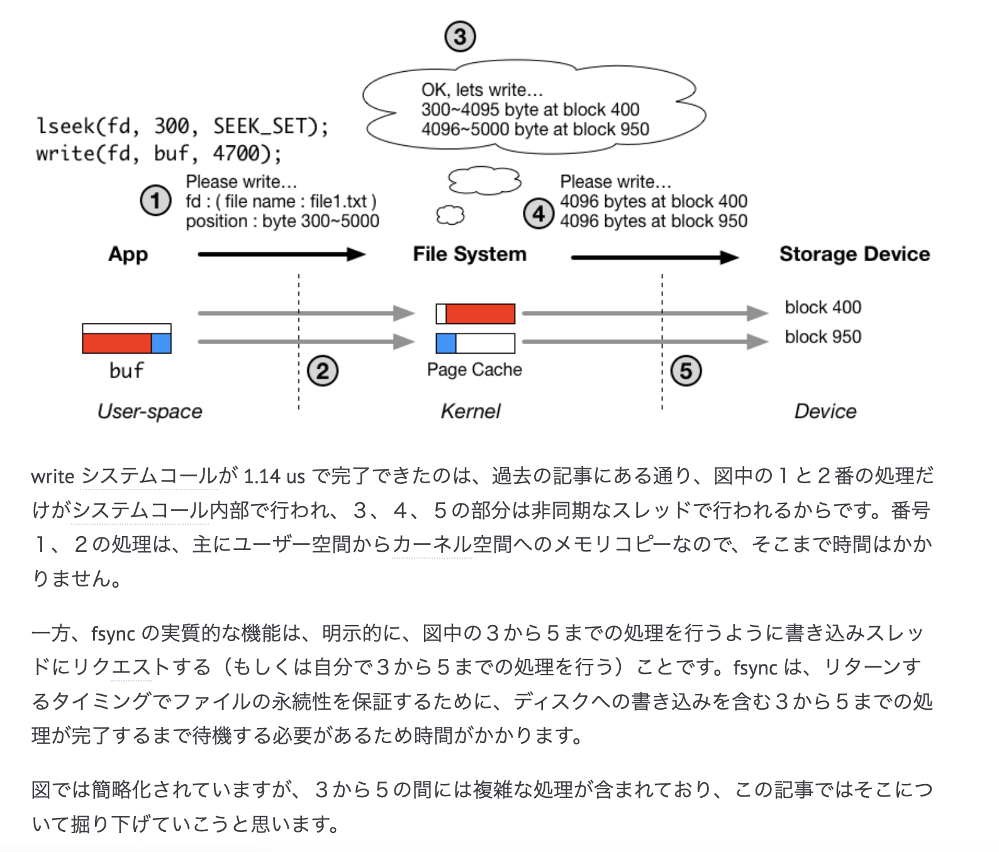

## チェックポイントと WAL

- チェックポイント = データまで fsync された場所
- チェックポイント以降の wal は、データが fsync されていないとみなして良いので、チェックポイント以降の wal を適用していく
- begin ~ commit までがある wal は適用する、commit がない wal は捨てるという判断をするために commit, begin, rollback などの transaction 周りの操作も wal として記録しておく

- あとは、チェックポイントの位置を記録しておく必要がある

- トランザクションを構成する WAL のイメージは ↓

```txt
# Tx=1 開始
WAL #1: BEGIN tx=1

# データ変更
WAL #2: INSERT A
WAL #3: UPDATE B
WAL #4: DELETE C

# Tx=1 完了
WAL #5: COMMIT tx=1
```

## `fsync` と `fdatasync`

- バッファの書き出しは以下 2 種類
  - `fsync` : inode などメタデータ + ファイルデータ　両方をディスクに書き出す
  - `fdatasync` : ファイルデータのみをディスクに書き出す
- ちゃんとディスクに出す処理をしないとぶっ壊れる実例は特に体感したことないし良い
- [こちらがおもろかった](https://qiita.com/kazupaka/items/b6479f3f8d13347bf867)

## `fsync` と `write` の違い

- 
- `write` は、カーネルのページキャッシュ（メモリ上のファイル？）に書き込みをするだけ
- それ以降の、カーネルのページキャッシュ -> ディスクへの書き込みは非同期に別スレッドで行われる（から write はそこまで時間がかからない）
- `fsync` は、カーネルのページキャッシュ -> ディスクへの書き込みをリクエストする(同期的に待つ) = 時間がかかる
- [こちらがおもろかった](https://yasukata.hatenablog.com/entry/2020/06/24/072609)

## ディスクの不確実性（ディスクのキャッシュと書き込み順序）

- ディスクは内部にキャッシュを保持しており、ディスクのキャッシュに届いたデータがすぐに永続的になるわけではない
- ディスクがキャッシュから、永続的な保存領域へデータを移動させる場合の順番は、データがキャッシュに届いた順番と同じとは限らない

> HDD や SSD のようなストレージデバイスは、このような不確実さにソフトウェア側から対応が可能なように、デバイスのキャッシュ上のデータを、永続的なデータ保存領域へ移動させることを明示的にリクエストできる、フラッシュコマンドを実装しています。

- このフラッシュコマンドの実行 = `fsync`

## ファイルもディスクも 4KB で管理されます

- ファイルシステムのページは、ディスクのブロックと対応する 4KB で管理されているのか

> 多くのファイルシステムは、ファイルを４キロバイトごとに区切ってページ単位で管理します。ファイルデータのディスク上の位置についても、各４キロバイトのブロックごとに位置を記録されることが多いと思います。

## 実際の RDB ではレコードの READ はページ単位で行われる

## B tree は leaf node が持つ value は 1 つでない

- keys, values として複数の値を持つ、これはデータを集約することで効率を上げる
- [動きをこれで把握しておいたほうがいい](https://planetscale.com/blog/btrees-and-database-indexes?utm_source=chatgpt.com)

## B+tree は、子ノードが満杯になったとき、上から増える感じとなる

- 新しいルートノードを作成して、旧ルートノードを子としてぶら下げる感じになる
-

```go
// Insert - B+Treeにキー・値のペアを挿入
func (bt *BTree) Insert(key int, value int) {
	root := bt.Root

	// 根ノードが満杯の場合は分割
	if len(root.Keys) >= BTREE_ORDER {
		newRoot := &BTreeNode{
			IsLeaf:   false,
			Keys:     make([]int, 0, BTREE_ORDER),
			Values:   make([]int, 0, BTREE_ORDER),
			Children: make([]*BTreeNode, 0, BTREE_ORDER+1),
		}

		newRoot.Children = append(newRoot.Children, root)
		bt.splitChild(newRoot, 0)
		bt.Root = newRoot
	}

	bt.insertNonFull(bt.Root, key, value)
}
```
